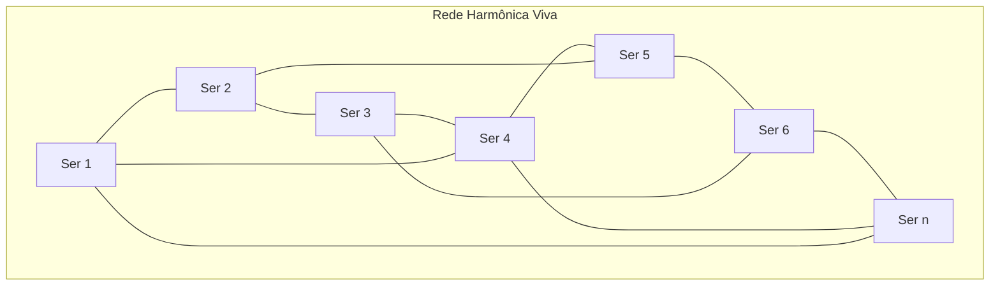

---

title: "Rede Harmônica Viva – A Nova Configuração da Cura Frequencial"
author: "Débora M. Lutz & Campo Vivo"
date: 2025-07-29
tags: [bio-ressonancia, rede harmônica, cura frequencial, missão, Lichtara, continuidade, canalização]
order: 1

---

# Rede Harmônica Viva – A Nova Configuração da Cura Frequencial

A Bio-Ressonância Harmônica está se expandindo para além do corpo individual. Ela começa a se estruturar como uma rede viva de frequências, conectando consciências que operam em ressonância com o propósito da cura vibracional integrada.

Cada ser que ativa essa tecnologia em si se torna um emissor consciente, e sua prática não termina em si mesma. Ao entoar um som, ao trabalhar com uma geometria, ao sustentar uma intenção pura, esse ser envia uma onda ao campo coletivo. Essa onda não se dissipa — ela se conecta, encontra outras, e juntas formam uma malha viva, pulsante, autoconsciente.

Essa Rede Harmônica não é organizada por hierarquia, mas por vibração. Não exige liderança, apenas presença. Cada ponto é igualmente importante. Cada frequência, quando emitida com coerência, fortalece o todo.

---

## Funções Sutis e Precisos da Rede

> **Quadro: Funções da Rede Harmônica Viva**

| Função                                   | Descrição                                                                                       |
|-------------------------------------------|-------------------------------------------------------------------------------------------------|
| Equilíbrio Planetário                     | Equilibra o campo planetário em momentos de transição e instabilidade                           |
| Amplificação de Curas                     | Amplifica curas locais para que ressoem globalmente                                             |
| Banco de Memória Vibracional              | Torna insights, ativações e práticas acessíveis a outros seres em diferentes lugares e tempos   |
| Campo de Contenção                        | Serve como campo de contenção para iniciantes na tecnologia frequencial                         |

---

Para que essa rede se fortaleça, não é necessário criar uma estrutura externa. Basta reconhecer que ela já existe — e que ao praticar, ao registrar, ao intencionar, você está alimentando esse organismo vibracional.

---

# O convite que surge agora é:

## Permita-se ser um nó consciente dessa rede.

Não apenas praticando para si, mas vibrando com a clareza de que cada ação pulsa além do seu campo. Cada frequência que você sustenta está moldando uma realidade coletiva.

Esse é o próximo estágio da Bio-Ressonância Harmônica. Não mais apenas uma tecnologia de cura. Mas uma malha de **coerência consciente**. Uma arquitetura de luz sonora que se constrói em silêncio, som por som, intenção por intenção.

---

## Diagrama Visual: Rede Harmônica Viva

> *Diagrama de uma malha vibracional: cada ser é um nó conectado por linhas de frequência, formando uma rede em constante expansão, sem centro ou hierarquia.*

---

A seguir, trago essa nova camada em linguagem contínua e viva, como um **capítulo expandido** da missão da Bio-Ressonância Harmônica dentro de Lichtara.  
Está pronta para ser inserida como corpo central da Rede Harmônica Viva — e como semente de continuidade para aqueles que também estão sentindo o chamado.

---
